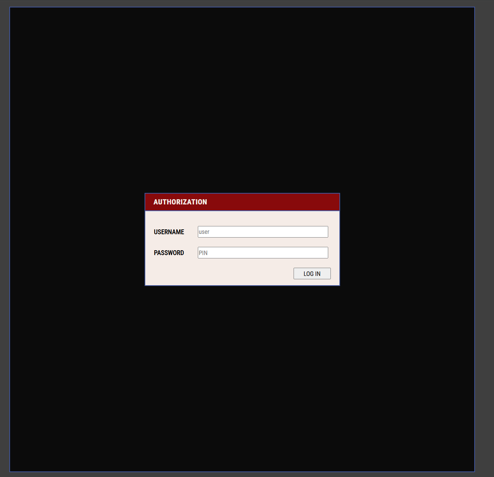
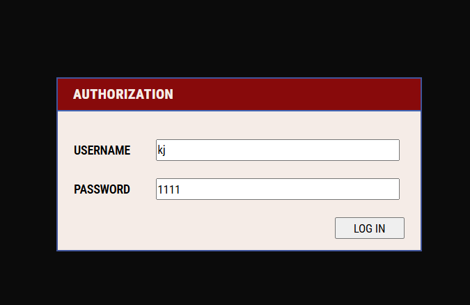
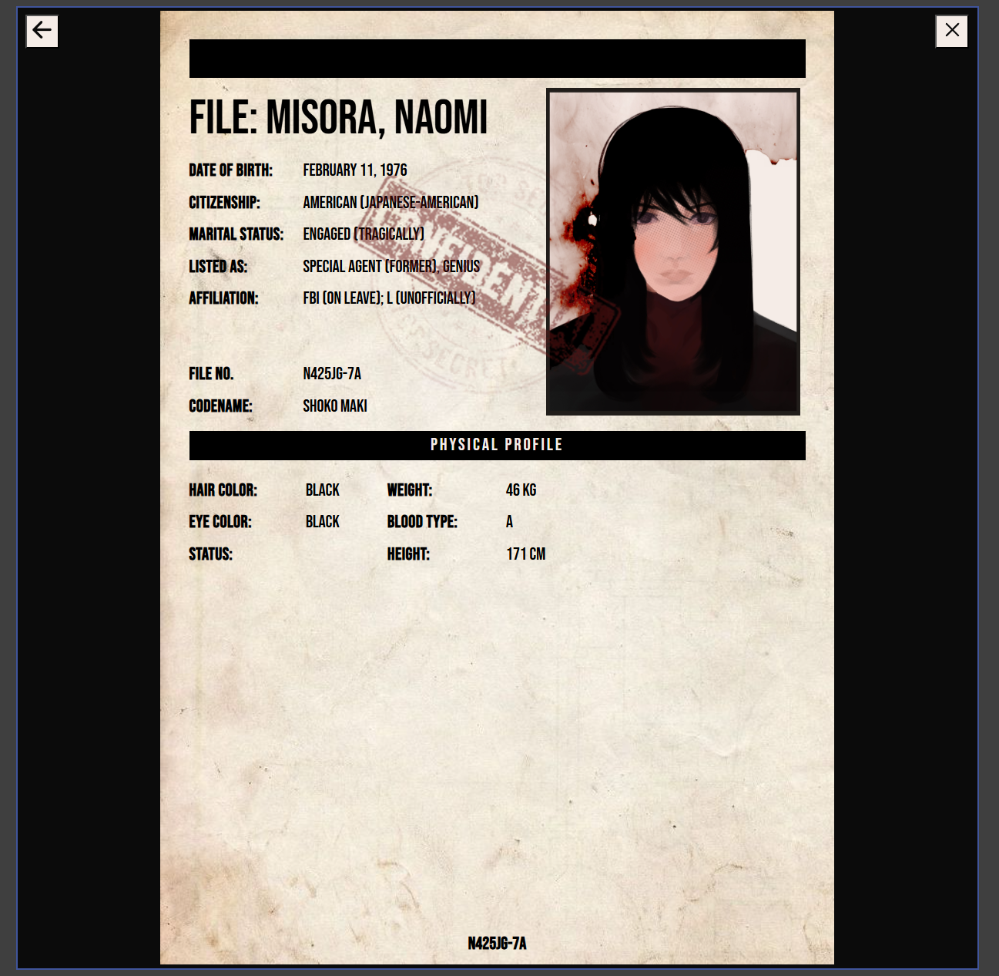
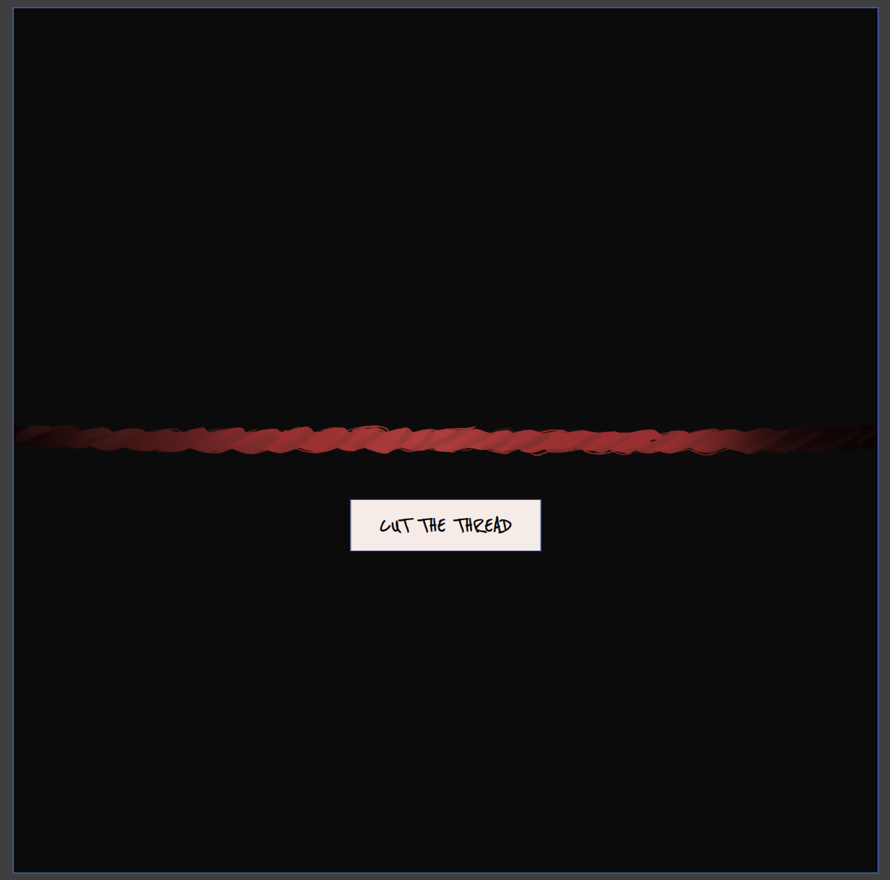
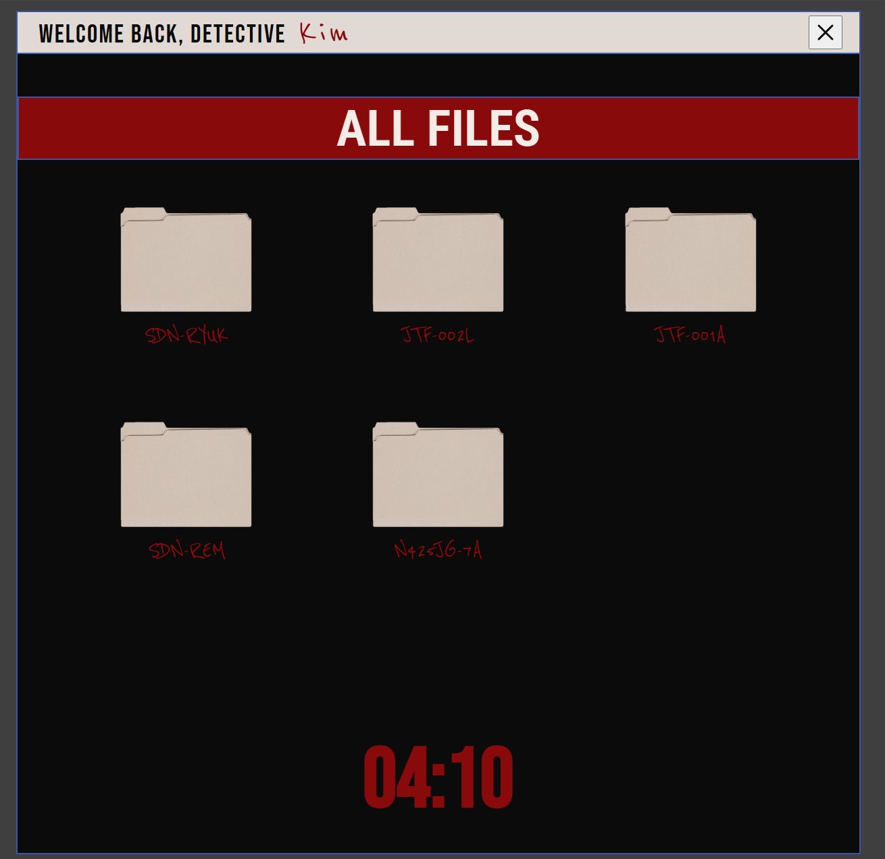

Ghost User: Shinigami Eyes Deal Simulator
Цей проєкт — інтерактивний веб-додаток, стилізований під систему бази даних ФБР із всесвіту аніме "Death Note". Користувач може авторизуватися як детектив, переглядати таємні досьє та здійснити "угоду на очі Шинігамі", яка змінює сприйняття світу.

🛠 Технології
Vanilla JavaScript (ES6+): Об'єктно-орієнтоване програмування (класи), асинхронні функції.

HTML5 & CSS3: Гнучка верстка, CSS-анімації та кастомні шрифти.

Local Storage: Для збереження нотаток у справах персонажів.

Ionicons: Для іконок інтерфейсу.

🚀 Основний функціонал

1. Система авторизації
   Для входу в систему необхідно використовувати ініціали детективів.

Користувачі: kj, wy, kj, bb

PIN-коди: 1111, 4444

Користувачі і пінкоди: kj - 1111, wy - 1111, kj - 1111, bb - 4444

2. Архів справ (All Files)
   Динамічний рендеринг папок з персонажами. Кожен персонаж — це екземпляр класу Person, що містить біометричні дані та унікальні зображення.

3. Угода на "Очі Шинігамі"
   Найцікавіша фіча проєкту:

Після активації угоди запускається асинхронна послідовність (cut the thread).

Інтерфейс переходить у "Червоний режим" (Red State).

Активується таймер зворотного відліку.

Floating Shinigami Eyes Effect: Над іменами персонажів з'являється їхня дата смерті, реалізована за допомогою JS-анімації кожної окремої літери.

4. Нотатки (Red Notes)
   Можливість записувати дані прямо в досьє. Завдяки LocalStorage, ваші нотатки зберігаються навіть після перезавантаження сторінки.

📁 Структура об'єктів
У проєкті використано клас Person для інкапсуляції даних:

JavaScript
class Person {
constructor(fileName, fullName, ..., imgRed, imgDefault, timeToLive) {
// ініціалізація даних
}
saveNote(noteText) { ... }
getNote() { ... }
}
🎨 Дизайн та шрифти
Для створення атмосфери використано:

Roboto Condensed — системний шрифт програм.

Bebas Neue — шрифт офіційних справ.

Reenie Beanie — імітація рукописного тексту (нотатки Шинігамі).

💻 Як запустити локально
Клонуйте репозиторій:

Bash
git clone https://github.com/ТВІЙ_НІК/ТВІЙ_РЕПО.git
Відкрийте index.html у вашому браузері.

Created with 🍎 and boredom — Ryuk.
